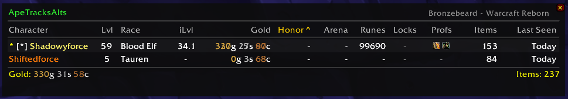
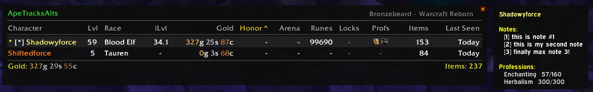
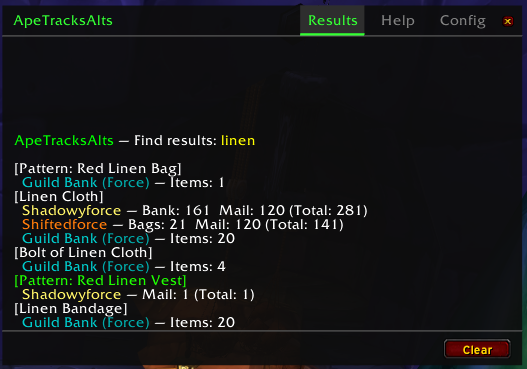

# ApeTracksAlts

A multi-character tracking addon for **Project Ascension** (WotLK 3.3.5 — Bronzebeard · Warcraft Reborn), built by **JamminApe**.

Track items, gold, professions, lockouts, wishlists, notes, and guild banks across all your alts — without logging into each one.

---

## Features at a Glance

- **Item tooltips** — see which alts have an item and how many, across bags, bank, and mail
- **Character panel** — sortable overview of all tracked characters with gold, iLvl, honor, professions, lockouts, and item counts
- **Item search** — `/ata find` searches all characters and registered guild banks
- **Wishlist** — shift-click items to add them; tooltips highlight wanted items
- **Notes** — up to 3 notes per character, visible in the panel hover tooltip
- **Guild bank tracking** — per-character registration; each alt only sees banks they can access
- **Professions & recipes** — scan and search across all alts
- **Lockout tracking** — see raid/dungeon lockouts and time remaining per character
- **Tabbed results window** — Results, Help, and Config tabs keep chat clean
- **Questie-X compatible** — private tooltip frame prevents Questie from interfering with panel tooltips

---

## Installation

1. Download or clone this repository
2. Place the `ApeTracksAlts` folder into your `World of Warcraft/Interface/AddOns/` directory
3. Launch the game and enable the addon in the character select screen
4. Log into each character at least once to begin tracking

---

## Quick Start

Log into a character — the addon immediately begins scanning bags, bank, mail, gold, professions, and lockouts. A character panel opens automatically.

Open the **minimap button** (left-click) to toggle the panel. Hover any item in your bags to see which alts have it.

---

## The Character Panel

The panel shows all tracked characters sorted by any column. Click a column header to sort; click again to reverse. The currently logged-in character is always pinned to the top with a `[*]` marker.

**Columns:** Character · Lvl · Race · iLvl · Gold · Honor · Arena · Runes · Locks · Profs · Items · Last Seen

- `*` to the left of a name indicates that character has notes
- Stale characters (not seen in 7+ days) are dimmed with a `[!]` marker
- Hover any row to see notes, professions, and lockout details in a tooltip to the right of the panel

---

## Item Tooltips

Hover any item to see:
- Which characters have it and in which location (Bags / Bank / Mail)
- Guild bank counts for banks registered to your current character
- A **"Wanted by"** line if the item is on any character's wishlist
- Account-wide total

Guild bank results appear below a separator line in **teal**, sorted after all character results.

> Characters with zero of an item are hidden — the tooltip only shows who actually has it.

---

## Slash Commands

All commands use `/ata` or `/apetracksalts`. Type `/ata help` or `/ata` to open the full Help tab in the results window.

### Search & Database

| Command | Description |
|---|---|
| `/ata find <item>` | Search for an item across all alts and guild banks. Supports shift-clicked item links. |
| `/ata recipe <name>` | Search learned recipes across all alts |
| `/ata locks` | Show raid/dungeon lockouts for all alts |
| `/ata prof` | Show professions and skill levels for all alts |
| `/ata gold` | Gold summary across all alts |
| `/ata list` | List all tracked characters with stats |

### Wishlist

| Command | Description |
|---|---|
| `/ata want [link or name]` | Add item to current character's wishlist (shift-click an item link) |
| `/ata want list` | Show all wishlists |
| `/ata want list <Name>` | Show a specific character's wishlist |
| `/ata want clear <item>` | Remove item from wishlist |
| `/ata want clear all` | Clear entire wishlist |

### Notes (max 3 per character)

| Command | Description |
|---|---|
| `/ata note <text>` | Add a note for the current character |
| `/ata note <CharName> <text>` | Add a note for any character (cross-character) |
| `/ata note list` | Show all notes numbered |
| `/ata note clear <#>` | Remove a specific note by number |
| `/ata note clear <CharName> <#>` | Remove a numbered note from any character |
| `/ata note clear` | Clear all notes for current character |

Notes appear in the panel row hover tooltip. A `*` marker appears to the left of the character name when notes exist.

### Guild Bank

| Command | Description |
|---|---|
| `/ata guild add` | Register the current guild's bank for **this character** |
| `/ata guild remove` | Unregister the current guild's bank for this character |
| `/ata guild scan` | Manually scan the open guild bank |
| `/ata guild list` | Show guild banks registered for the current character |
| `/ata guild auto on\|off` | Toggle auto-registration when opening a guild bank |

> **Important — Guild Bank Display is Per-Character by Design**
>
> Each character only sees guild bank data from banks **they personally registered**. If Shadowyforce registers the raiding guild bank (Force) and your personal bank guild (Vault), Shiftedforce will not see either of those banks unless Shiftedforce also registers them.
>
> This is intentional. A character who is not in a guild, or is not an officer with bank access, should not see guild bank counts in their tooltips. It keeps tooltips accurate and relevant to what each character can actually access.
>
> **How to register:** Stand near the guild bank NPC, open the bank, then run `/ata guild add`. The bank is scanned automatically on open. Click through tabs to update all tab data — WoW only loads tab contents when physically clicked.

### Settings

| Command | Description |
|---|---|
| `/ata config` | Open the Config tab showing all current settings |
| `/ata set stale <days>` | Set stale character threshold (default: 7 days) |
| `/ata set profstale <days>` | Set profession stale threshold (default: 30 days) |
| `/ata toggle login` | Toggle panel auto-open on login |
| `/ata toggle bags\|bank\|mail` | Toggle individual locations in item tooltips |
| `/ata ignore <name>` | Hide a character from item tooltips |
| `/ata unignore <name>` | Remove a character from the ignore list |
| `/ata minimap` | Toggle the minimap button |
| `/ata output` | Toggle the results window |

### Database Management

| Command | Description |
|---|---|
| `/ata purge <name>` | Remove a specific character from the database |
| `/ata reset` | Wipe the entire database (cannot be undone) |
| `/ata debug` | Show database stats (character count, item count) |

---

## The Results Window

Search results, gold summaries, lockouts, professions, and recipe searches all print to the **Results tab** instead of cluttering chat. The window stays open between searches so you can compare results.

- **Results tab** — all slash command output
- **Help tab** — full command reference, sectioned by category
- **Config tab** — current settings, refreshed on each click

Use `/ata help` to open directly to the Help tab. Use `/ata config` to open directly to the Config tab.

The window is draggable and remembers its position across sessions. Mousewheel scrolls through results. The **Clear** button wipes results; the **X** button closes the window.

---

## Scanning Notes

- **Bags** — scanned automatically on login and whenever bags change
- **Bank** — scanned when you open the bank frame
- **Mail** — scanned when you open the mailbox
- **Professions** — scanned when you open your profession book
- **Lockouts** — scanned on login and when instance info updates
- **Guild bank** — scanned when you open the guild bank (registered banks only); click through all tabs to ensure full coverage — WoW only provides tab data when a tab has been physically viewed

---

## Compatibility

- **Project Ascension** — WotLK 3.3.5 (Interface 30300)
- **ElvUI** — fully compatible; automatically uses Expressway font when ElvUI is loaded
- **Questie-X** — compatible; uses a private tooltip frame to prevent Questie's BAG_UPDATE_DELAYED events from interfering with panel hover tooltips

---

## SavedVariables

| Variable | Contents |
|---|---|
| `ApeTracksAltsDB` | Per-character data (items, gold, professions, lockouts, recipes, guild bank scan data) |
| `ApeTracksAltsCfg` | Settings, wishlist, notes, guild registration, panel/window positions |

Data is stored per-realm. Characters on different realms are tracked independently.

---

## Known Limitations

- Guild bank tab data is only available after physically clicking each tab at least once. This is a WoW engine limitation — the client does not pre-load all tab contents.
- Item tooltip counts reflect the last time that character was logged in. Characters not seen for 7+ days are marked stale.
- Recipe scanning requires opening the profession book on each character.

---

## Author

**JamminApe** — Bronzebeard · Warcraft Reborn  
GitHub: https://github.com/JamminApe/ApeTracksAlts

---

## License

Personal use. Do not redistribute without permission.
